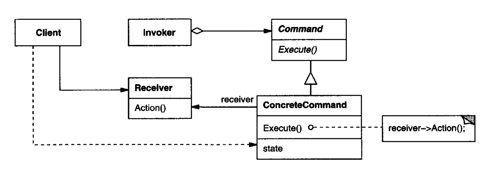
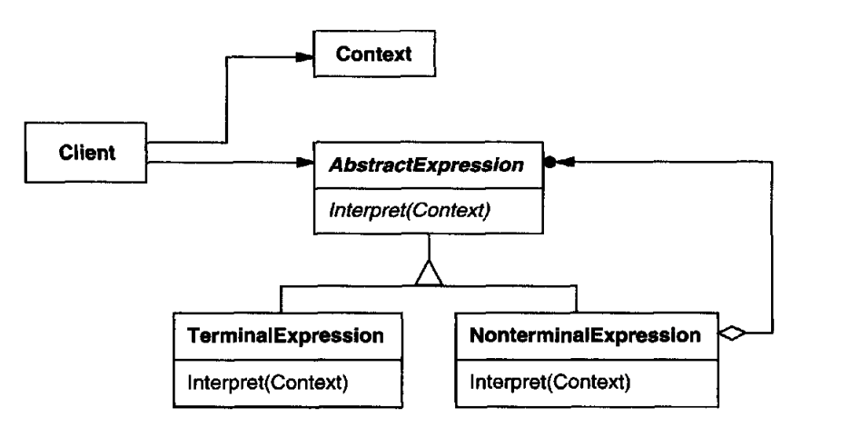
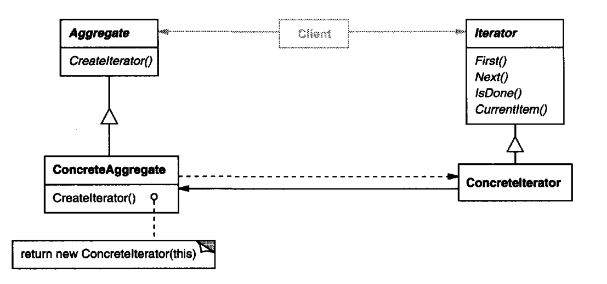
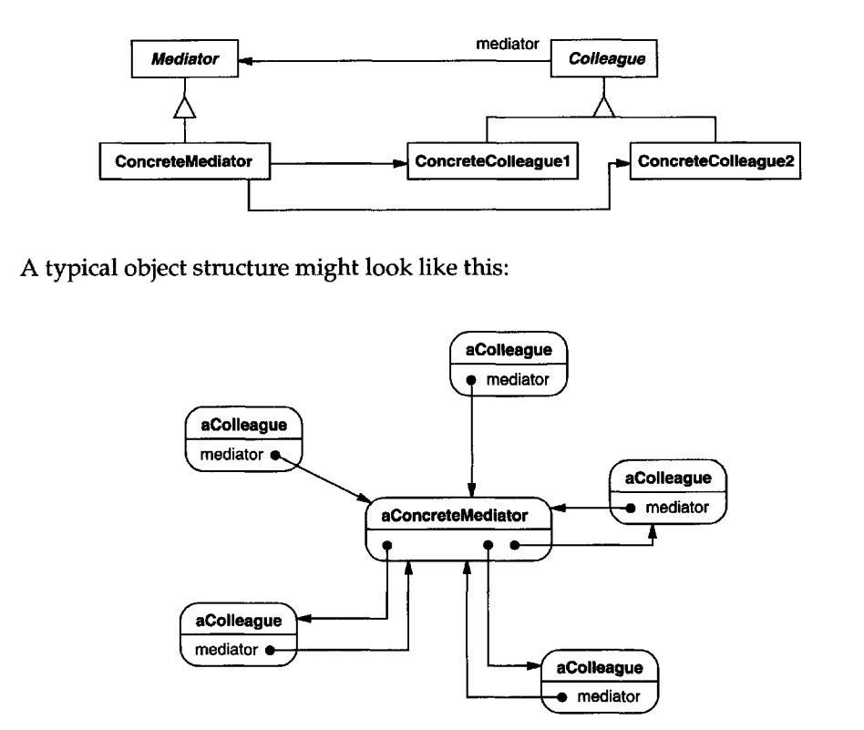
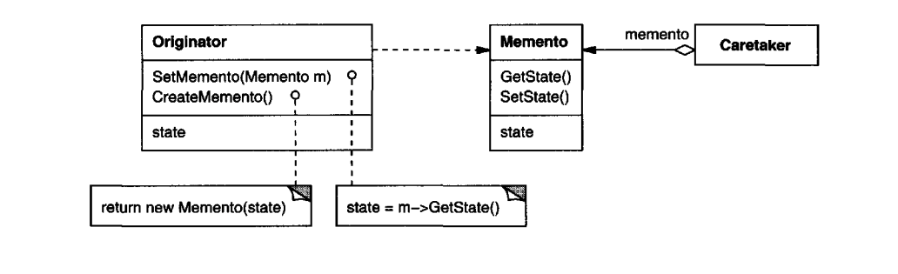
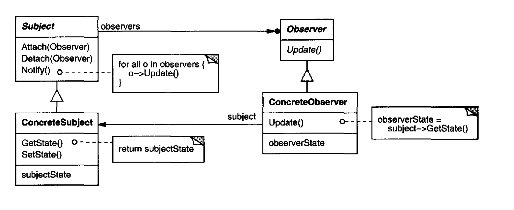
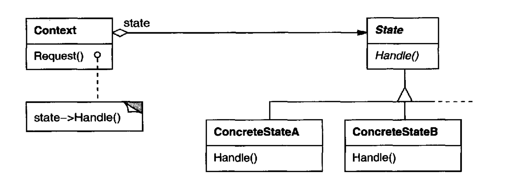
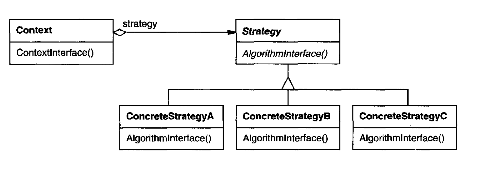
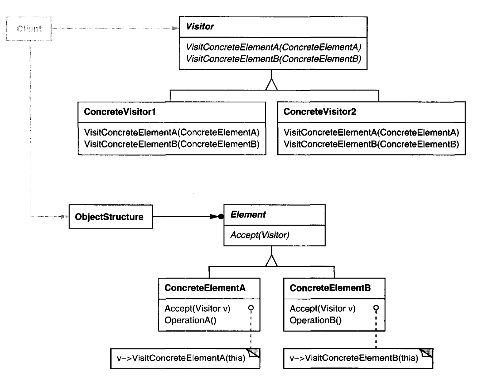

# Behavioral Pattern

## Chain of Responsibility
### Intent
Avoid coupling the sender of a request to its receiver by giving more than one object a chance to handle the request. Chain the receiving objects and pass the request along the chain until an object handles it.
### Applicability
+ more than one object may handle a request, and the handler isn't known a priori. The handler should be ascertained automatically.
+ you want to issue a request to one of several objects without specifying the receiver explicitly.
+ the set of objects that can handle a request should be specified dynamically.
### Structure

### Participants
+ Handler (HelpHandler)
    - defines an interface for handling requests.
    - (optional)implements the successor link
+ ConcreteHandler (PrintButton, PrintDialog)
    - handles requests it is responsible for.
    - can access its successor.
    - if the ConcreteHandler can handle the request, it does so; otherwise it forwards the request to its successor.
+ Client
    - initiates the request to a ConcreteHandler object on the chain.
### [Sample Code](./code/Chain%20of%20Responsibility.cpp)

## Command (Action,Transaction)
### Intent
Encapsulate a request as an object, thereby letting you parameterize clients with different requests, queue or log requests, and support undoable operations.
### Applicability
+ parameterize objects by an action to perform, as MenuItem objects did above. You can express such parameterization in a procedural language with a callback function, that is, a function that's registered somewhere to be called at a later point. Commands are an object-oriented replacement for callbacks.
+ specify, queue, and execute requests at different times. A Command object can have a lifetime independent of the original request. If the receiver of a request can be represented in an address space-independent way, then you can transfer a command object for the request to a different process and fulfill the request there.
+ support undo. ThecCommand's Execute operation can store state for reversing its effects in the command itself. The Command interface must have an added Unexecute operation that reverses the effects of a previous call to Execute. Executed commands are stored in a history list.Unlimited-level undo and redo is achieved by traversing this list backwards and forwards calling Unexecute and Execute,respectively.
+ support logging changes so that they can be reapplied in case of a system crash. By augmenting the Command interface with load and store operations, you can keep a persistent log of changes. Recovering from a crash involves reloading logged commands from disk and reexecuting them with the Execute operation.
+ structure a system around high-level operations built on primitives operations. Such a structure is common in informationsystems that support transactions. A transaction encapsulates a set of changes to data. The Command pattern offers a way to model transactions. Commands have a common interface, letting you invoke all transactions the same way. The pattern also makes it easy to extend the system with new transactions.
### Structure

### Participants
+ Command
    - declares an interface for executing an operation.
+ ConcreteCommand (PasteCommand, OpenCommand)
    - defines a binding between a Receiver object and an action.
    - implements Execute by invoking the corresponding operation(s) on Receiver.
+ Client (Application)
    - creates a ConcreteCommand object and sets its receiver.
+ Invoker (Menultem)
    - asks the command to carry out the request
+ Receiver (Document, Application)
    - knows how to perform the operations associated with carrying out a request. Any class may serve as a Receiver.
### [Sample Code](./code/Command.cpp)

## Interpreter
### Intent
Given a language, define a represention forits grammar along with an interpreter that uses the representation to interpret sentences in the language.
### Applicability
Use the Interpreter pattern when there is a language to interpret, and you can represent statements in the language as abstract syntax trees. The Interpreter pattern works best when
• the grammar is simple. They can interpret expressions without building abstract syntax trees, which can save space and possibly time.
• efficiency is not a critical concern. The most efficient interpreters are usually not implemented by interpreting parse trees directly but by first translating them into another form. 
### Structure

### Participants
+ AbstractExpression (RegularExpression)
    - declares an abstract Interpret operation that is common to all nodes in the abstract syntax tree.
+ TerminalExpression (LiteralExpression)
    - implements an Interpret operation associated with terminal symbols in the grammar.
    - an instance is required for every terminal symbol in a sentence.
+ NonterminalExpression (AlternationExpression, RepetitionExpression, SequenceExpressions)
    - one such class is required for every rule R ::= R1R2...Rn in the grammar.
    - maintains instance variables of type AbstractExpression for each of the symbols R1 through Rn.
    - implements an Interpret operation for nonterminal symbols in the grammar. Interpret typically calls itself recursively on the variables representing R1 through Rn.
+ Context
    - contains information that's global to the interpreter.
+ Client
    - builds (or is given) an abstract syntax tree representing a particular sentence in the language that the grammar defines. The abstract syntax tree is assembled from instances of the NonterminalExpression and TerminalExpression classes.
    - invokes the Interpret operation
### [Sample Code](./code/Interpreter.cpp)

## Iterator (Cursor)
### Intent
Provide a way to access the elements of an aggregate object sequentially without exposing its underlying representation.
### Applicability
+ to access an aggregate object's contents without exposing its internal representation.
+ to support multiple traversals of aggregateobjects.
+ to provide a uniform interface for traversing different aggregate structures(that is, to support polymorphic iteration).
### Structure

### Participants
+ Iterator
    - defines an interface for accessing and traversing elements.
+ Concretelterator
    - implements theIterator interface.
    - keeps track of the current position in the traversal of the aggregate.
+ Aggregate
    - defines an interface for creating an Iterator object.
+ ConcreteAggregate
    - implements the Iterator creation interface to return an instance of the proper Concretelterator.
### [Sample Code](./code/Iterator.cpp)

## Mediator
### Intent
Define an object that encapsulates how a set of objects interact. Mediator promotes loose coupling by keeping objects from referring to each other explicitly, and it lets you vary their interaction independently.
### Applicability
+ a set of objects communicatein well-defined but complexways.The resulting interdependencies are unstructured and difficult to understand.
+ reusing an object is difficult because itrefers to and communicates with many other objects.
+ a behavior that's distributed between several classes should be customizable without a lot of subclassing.
### Structure

### Participants
+ Mediator (DialogDirector)
    - defines an interface for communicating with Colleague objects.
+ ConcreteMediator (FontDialogDirector)
    - implements cooperative behavior bycoordinating Colleague objects.
    - knows andmaintains itscolleagues.
+ Colleague classes (ListBox, EntryField)
    - each Colleague class knows itsMediator object.
    - each colleague communicates with its mediator whenever it would have otherwise communicated with another colleague.
### [Sample Code](./code/Mediator.cpp)

## Memento (Token)
### Intent
Without violating encapsulation, capture and externalize an object's internal state so that the object can be restored to this state later.
### Applicability
+ snapshot of (some portion of) an object's state must be saved so that it can be restored to that state later, and
+ a direct interface to obtaining the state would expose implementation details and break the object's encapsulation.
### Structure

### Participants
+ Memento (SolverState)
    - stores internal state of the Originator object. The memento may store as much or as little of the originator's internal state as necessary at its originator's discretion.
    - protects against access by objects other than the originator. Mementos have effectively two interfaces. Caretaker sees a narrow interface to the Memento—it can only pass the memento to other objects. Originator, in contrast, sees a wide interface, one that lets it access all the data necessary to restore itself to its previous state. Ideally, only the originator that produced the memento would be permitted to access the memento's internal state.
+ Originator (ConstraintSolver)
    - creates a memento containing a snapshot of its current internal state.
    - uses the memento to restore its internal state.
+ Caretaker (undo mechanism)
    - is responsible for the memento's safekeeping.
    - never operates on or examines the contents of a memento.
### [Sample Code](./code/Memento.cpp)

## Observer (Dependents, Publish-Subscribe)
### Intent
Define a one-to-many dependency between objects so that when one object changes state, all its dependents are notified and updated automatically.
### Applicability
+ When an abstraction has two aspects, one dependent on the other. Encapsulating these aspects in separate objects lets you vary and reuse them independently.
+ When a change to one object requires changing others, and you don't know how many objects need to be changed.
+ When an object should be able to notify other objects without making assumptions about who these objects are.In other words, you don't want these objects tightly coupled.
### Structure

### Participants
+ Subject
    - knows its observers. Any number of Observer objects may observe a subject.
    - provides an interface for attachingand detaching Observer objects.
+ Observer
    - defines an updating interface for objects that should be notified of changes in a subject.
+ ConcreteSubject
    - stores state of interest to ConcreteObserver objects.
    - sends a notification to its observers when itsstate changes.
+ ConcreteObserver
    - maintains a reference to a ConcreteSubject object.
    - stores state that should stay consistent with the subject's.
    - implements the Observer updating interface to keep its state consistent with the subject's.
### [Sample Code](./code/Observer.cpp)

## State
### Intent
Allow an object to alter its behavior when its internal state changes. The object will appear to change its class.
### Applicability
+ An object's behavior depends on its state, and it must change its behavior at run-time depending on that state.
+ Operations have large, multipart conditional statements that depend on the object's state.
### Structure

### Participants
+ Context (TCPConnection)
    - defines the interface ofinterest to clients.
    - maintains an instance of a ConcreteState subclass that defines the current state.
+ State (TCPState)
    - defines an interface for encapsulating the behavior associated with a particular state of the Context.
### [Sample Code](./code/State.cpp)

## Strategy (Policy)
### Intent
Define a family of algorithms, encapsulate each one, and make them interchangeable. Strategy lets the algorithm vary independently from clients that use it.
### Applicability
+ many related classes differ only in their behavior. Strategies provide a way to configure a class with one of many behaviors.
+ you need different variants of an algorithm.
+ an algorithm uses data that clients shouldn't know about. Use the Strategy pattern to avoid exposing complex, algorithm-specific data structures.
+ a class defines many behaviors, and these appear as multiple conditional statements in its operations. Instead of many conditionals, move related conditional branches into their own Strategy class.
### Structure

### Participants
+ Strategy (Compositor)
    - declares an interface common to all supported algorithms. Context uses this interface to call the algorithm defined by a ConcreteStrategy.
+ ConcreteStrategy (SimpleCompositor, TeXCompositor, ArrayCompositor)
    - implements the algorithm using the Strategy interface.
+ Context (Composition)
    - is configured with a ConcreteStrategy object.
    - maintains a reference to a Strategy object.
    - may define an interface that lets Strategy access its data.
### [Sample Code](./code/Strategy.cpp)

## Template Method
### Intent
Define the skeleton of an algorithm in an operation, deferring some steps to subclasses.Template Method lets subclasses redefine certain steps of an algorithm without changing the algorithm's structure.
### Applicability
+ to implement the invariant parts of an algorithm once and leave it up to subclasses to implement the behavior that can vary.
+ when common behavior among subclasses should be factored and localized in a common class to avoid code duplication.
+ to control subclasses extensions. 
### Structure

### Participants
+ AbstractClass (Application)
    - defines abstract primitive operations that concrete subclasses define to implement steps of an algorithm.
    - implements a template method defining the skeleton of an algorithm. The template method calls primitive operations as well as operations defined in AbstractClass or those of other objects.
+ ConcreteClass (MyApplication)
    - implements the primitive operations to carry outsubclass-specific steps of the algorithm.
### [Sample Code](./code/Template%20Method.cpp)

## Visitor
### Intent
Represent an operation to be performed on the elements of an object structure.Visitor lets you define a new operation without changing the classes of the elements on which it operates.
### Applicability
+ an object structure contains many classes of objects with differing interfaces, and you want to perform operations on these objects that depend on their concrete classes.
+ many distinct and unrelated operations need to be performed on objects in an object structure, and you want to avoid "polluting" their classes with these operations. Visitor lets you keep related operations together by defining them in one class. When the object structure is shared by many applications, use Visitor to put operations in just those applications that need them.
+ the classes defining the object structure rarely change, but you often want to define new operations over the structure. 
### Structure

### Participants
+ Visitor (NodeVisitor)
    - declares a Visit operation for each class of ConcreteElement in the object structure. The operation's name and signature identifies the class that sends the Visit request to the visitor. That lets the visitor determine the concrete class of the element being visited. Then the visitor can access the element directly through its particular interface.
+ ConcreteVisitor (TypeCheckingVisitor)
    - implements each operation declared byVisitor.Eachoperation implements a fragment of the algorithm defined for the corresponding class of object in the structure. ConcreteVisitor provides the context for the algorithm and stores its local state. This state often accumulates results during the traversal of the structure.
+ Element (Node)
    - defines an Accept operation that takes a visitor as an argument.
+ ConcreteElement (AssignmentNode,VariableRefNode)
    - implements an Accept operation that takes a visitor as an argument.
+ ObjectStructure (Program)
    - can enumerate its elements.
    - mayprovide a high-level interface to allow the visitor to visit its elements.
    - may either be a composite or a collection such as a list or a set.
### [Sample Code](./code/)