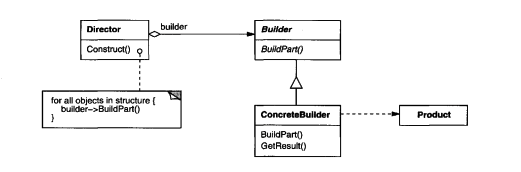
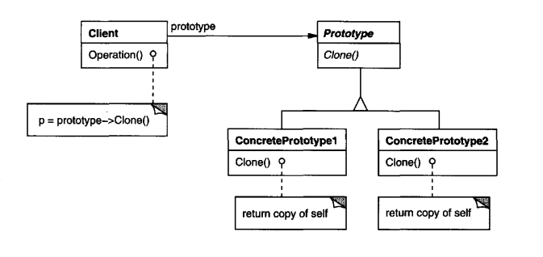
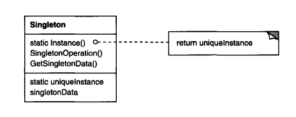

# Creational Pattern
abstract instantiation process

## Abstract Factory (Kit)
### Intent
provide an interface for creating families of related or dependent objects without specifying their concrete classes.
### Applicability
+ a system should be independent of how its products are created, composed, and represented
+ a system should be configured with one of multiple families of product
+ a family of related product objects is designed to be used together, and you need to enforce this constraint
+ you want to provide a class library of products, and you want to reveal just their interfaces, not their implementations
### Structure

### Participants
+ AbstractFactory
+ ConcreteFactory
+ AbstractProduct
+ ConcreteProduct
+ Client
### [Sample Code](https://github.com/Iris-Song/Object-Oriented-Design-Pattern/blob/main/code/Abstract%20Factory.cpp)

## Builder
### Intent
seperate the construction of a complex object from its representation so that the same construction process can create different representations. 
### Applicability
+ the algorithm for creating a complex object should be independent of the parts that make up the object and how they are assembled.
+ the construction process must allow different representations for the object that's constructed.
### Structure

### Participants
+ Builder (TextConverter)
+ ConcreteBuilder (ASCIIConverter, TeXConverter, TextWidgetConverter)
+ Director (RTFReader)
+ Product (ASCIIText, TeXText, TextWidget)
### Collaborations

### [Sample Code](./code/Builder.cpp)

## Factory Method (Virtual Constructor)
### Intent
define an interface for creating an object, but let subclasses decide which class to instantiate. Factory Method lets a class defer instantiation to subclasses
### Applicability
+ a class can't anticipate the class of objects it must create
+ a class want its subclasses to specify the object it creates
+ classes delegate responsibility to one of several helper subclasses, and you want to localize the knowledge of which helper subclass is the delegate
### Structure
 
### Participants
+ Product (Document)
+ ConcreteProduct (MyDocument)
+ Creator (Application)
+ ConcreteCreator (MyApplication)
### [Sample Code](./code/Factory%20Method.cpp)

## Prototype
### Intent
specify the kinds of objects to create using a prototypical instance, and create new objects by copying this prototype
### Applicability
Use the Prototype pattern when a system should be independent of how its products are created, composed, and represented; and
+ when the classes to instantiate are specified at run-time, for example, by dynamic loading; or
+ to avoid building a class hierarchy of factories that parallels the class hierarchy of products; or
+ when instances of a class can have one of only a few different combinations of state. It may be more convenient to install a corresponding number of prototypes and clone them rather than instantiating the class manually, each time with the appropriate state.
### Structure
 
### Participants
+ Prototype (Graphic)
+ ConcretePrototype (Staff, WholeNote, HalfNote)
+ Client (GraphicTool)
### [Sample Code](./code/Prototype.cpp)

## Singleton
### Intent
ensure a class only has one instance, and provide a global point of access to it
### Applicability
+ there must be exactly one instance of a class, and it must be accessible to clients from a well-known access point
+ when the sole instance should be extensible by subclassing, and clients should be able to use an extended instance without modifying their code.
### Structure

### Participants
+ Singleton
### [Sample Code](./code/Singleton.cpp)