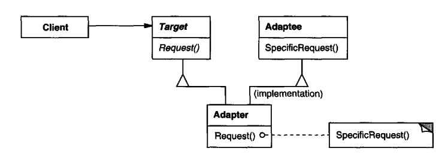
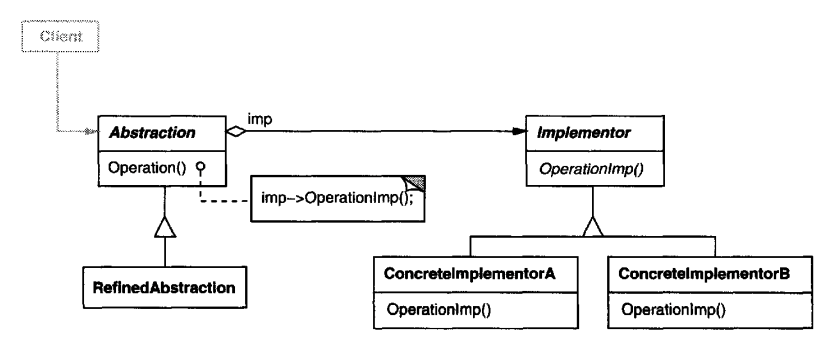
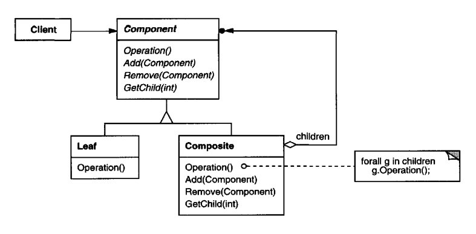
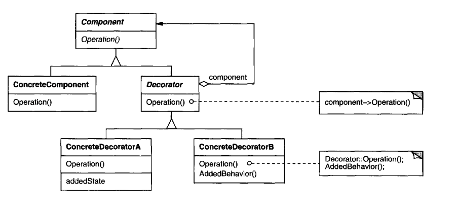
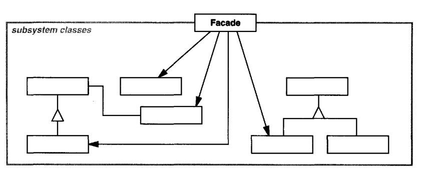
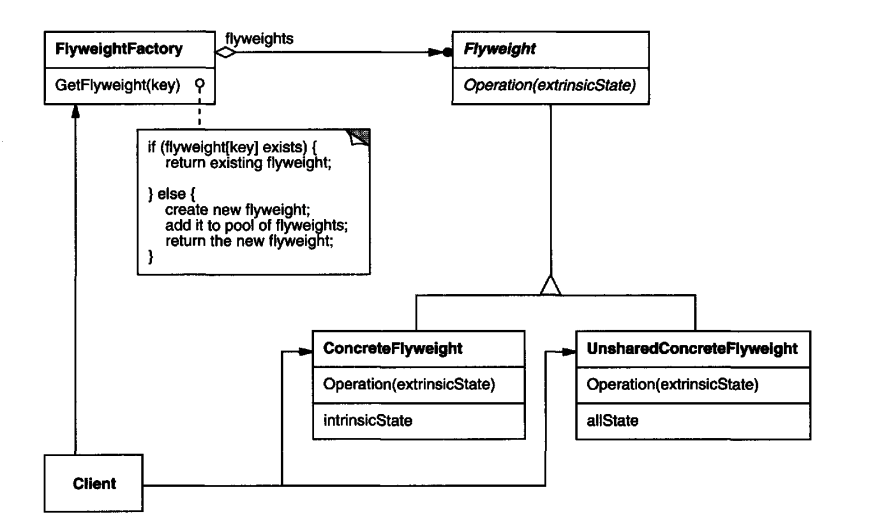
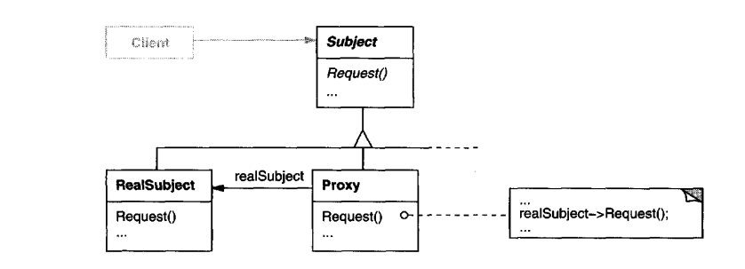

# Structural Pattern
Structural patterns are concerned with how classes and objects are composed to form larger structures. Structural class patterns use inheritance to compose interfaces or implementations.

## Adapter (Wrapper)
### Intent
Convert the interface of a class into another interface clients expect. Adapter lets classes work together that couldn't otherwise because of incompatible interfaces
### Applicability
+ you want to use an existing class, and its interface does not match the one you need.
+ you want to create a reusable class that cooperates with unrelated orunforeseen classes, that is, classes that don't necessarily have compatible interfaces.
+ (object adapter only) you need to use several existing subclasses, but it's unpractical to adapt their interface by subclassing every one. An object adapter can adapt the interface of its parent class.
### Structure
A class adapter uses multiple inheritance to adapt one interface to another:

An object adapter relies on object composition:

### Participants
+ Target
    - defines the domain-specific interface that Client uses.
+ Client
    - collaborateswith objects conforming to the Target interface.
+ Adaptee
    - defines an existing interface that needs adapting.
+ Adapter 
    - adapts the interface of Adaptee to the Target interface.
### [Sample Code](./code/Adapter.cpp)

## Bridge (Handle/Body)
### Intent
Decouple an abstraction from its implementation so that the two can vary independently.
### Applicability
+ you want to avoid a permanent binding between an abstraction and its implementation. This might be the case,for example,when the implementation must be selected or switched at run-time.
+ both the abstractions and their implementations should be extensible by subclassing. In this case, the Bridge pattern lets you combine the different abstractions and implementations and extend them independently.
+ changes in the implementation of an abstraction should have no impact on clients; that is, their code should not have to be recompiled.
+ (C++) you want to hide the implementation of an abstraction completely from clients. In C++ the representation of a class is visible in the class interface.
+ you have a proliferation of classes as shown earlier in the first Motivation diagram. Such a class hierarchy indicates the need forsplitting an object into two parts. Rumbaugh uses the term "nested generalizations" [RBP+91] to refer to such classhierarchies.
+ you want to share an implementation among multiple objects(perhaps using reference counting), and this fact should be hidden from the client. A simple example is Coplien's String class [Cop92], in which multiple objects can share the same string representation (StringRep).
### Structure
the relationship between Abstraction and Implementor is bridge

### Participants
+ Abstraction(Window)
    - defines theabstraction's interface.
    - maintains a reference to an object oftype Implementor.
+ RefmedAbstraction (IconWindow)
    - Extendsthe interface defined byAbstraction.
+ Implementor (Windowlmp)
    - defines the interface for implementation classes. This interface doesn't have to correspond exactly to Abstraction's interface;in fact the two interfaces can be quite different. Typically the Implementor interface provides only primitive operations, and Abstraction defines higher-level operations based on these primitives.
+ Concretelmplementor (XWindowImp, PMWindowImp)
    - implements the Implementor interface and defines its concrete implementation.
### [Sample Code](./code/Bridge.cpp)

## Composite
### Intent
Compose objects into tree structures to represent part-whole hierarchies. Composite lets clients treat individual objects and compositions of objects uniformly.
### Applicability
+ you want to represent part-whole hierarchies of objects.
+ you want clients to be able to ignore the difference between compositions of objects and individual objects.Clients will treat all objectsin the composite structure uniformly.
### Structure

### Participants
+ Component (Graphic)
    - declares the interface for objectsin the composition.
    - implements default behavior for the interface common to all classes, as appropriate.
    - declares an interface for accessing and managing its child components.
    - (optional) defines an interface for accessing a component's parent in the recursive structure, and implements it if that's appropriate.
+ Leaf (Rectangle, Line, Text, etc.)
    - represents leaf objects in the composition. A leaf has no children.
    - defines behavior for primitive objects in the composition.
+ Composite (Picture)
    - defines behavior for components having children.
    - stores child components.
    - implements child-related operations in the Component interface.
+ Client
    - manipulates objects in the composition through the Component interface.

## Decorator (Wrapper)
### Intent
Attach additional responsibilities to an object dynamically. Decorators provide a flexible alternative to subclassing for extending functionality.
### Applicability
+ to add responsibilities to individual objects dynamically and transparently without affecting other objects.
+ for responsibilities that can be withdrawn.
+ when extension by subclassing is impractical. Sometimes a large number of independent extensions are possible and would produce an explosion of subclasses to support every combination. Or a class definition maybe hidden or otherwise unavailable for subclassing.
### Structure

### Participants
+ Component (VisualComponent)
    - defines the interface for objects that can have responsibilities added to them dynamically.
+ ConcreteComponent (TextView)
    - defines an object to which additional responsibilities canbe attached.
+ Decorator
    - maintains a reference to a Component object and defines an interface that conforms to Component's interface.
+ ConcreteDecorator (BorderDecorator, ScrollDecorator)
    - adds responsibilities to the component.
### [Sample Code](./code/Decorator.cpp)

## Facade
### Intent
Provide a unified interface to a set of interfaces in a subsystem. Facade defines a higher-level interface that makes the subsystem easier to use.
### Applicability
+ you want to provide a simple interface to a complex subsystem. Subsystems often get more complex as they evolve. Most patterns, when applied, result in more and smaller classes. This makes the subsystem more reusable and easier to customize, but it also becomes harder to use for clients that don't need to customize it. A facade can provide a simple default view of the subsystem that is good enough for most clients. Only clients needing more customizability will need to look beyond the facade.
+ there are many dependencies between clients and the implementation classes of an abstraction. Introduce a facade to decouple the subsystem from clients
and other subsystems, thereby promoting subsystem independence and portability.
+ you want to layer your subsystems. Use a facade to define an entry point to each subsystem level. If subsystems are dependent, then you can simplify the dependencies between them by making them communicate with each other solely through their facades.
### Structure

### Participants
+ Facade (Compiler)
    - knows which subsystem classes are responsible for a request.
    - delegates client requests to appropriate subsystem objects.
+ subsystem classes (Scanner, Parser, ProgramNode, etc.)
    - implement subsystem functionality.
    - handle work assigned by the Facade object.
    - have no knowledge of the facade; that is, they keep no references to it.
### [Sample Code](./code/Facade.cpp)

## Flyweight
### Intent
Use sharing to support large numbers of fine-grained objects efficiently
### Applicability
+ An application uses a large number of objects.
+ Storage costs are high because of the sheer quantity of objects.
+ Most object state can be made extrinsic.
+ Many groups of objects may be replaced by relatively few shared objects once extrinsic state isremoved.
+ The application doesn't depend on object identity. Since flyweight objects may be shared, identity tests will return true for conceptually distinct objects.
### Structure

### Participants
+ Flyweight (Glyph)
    - declares an interface through which flyweights can receive and act on extrinsic state.
+ ConcreteFlyweight (Character)
    - implements the Flyweight interface and adds storage for intrinsic state, if any. A ConcreteFlyweight object must be sharable. Any state it stores must be intrinsic; that is, it must be independent ofthe ConcreteFlyweight object's context.
+ UnsharedConcreteFlyweight (Row, Column)
    - not all Flyweight subclasses need to be shared. The Flyweight interface enables sharing; it doesn't enforce it. It's common for UnsharedConcreteFlyweight objects to have ConcreteFlyweight objects as children at some level in the flyweight object structure (as the Row and Column classes have).
+ FlyweightFactory
    - creates and manages flyweight objects.
    - ensures that flyweights are shared properly. When a client requests a flyweight,the FlyweightFactory objectsupplies an existing instance or creates one, if none exists.
+ Client
    - maintains a reference to flyweight(s).
    - computes or stores the extrinsic state of flyweight(s)
### [Sample Code](./code/Flyweight.cpp)

## Proxy (Surrogate)
### Intent
Provide a surrogate or placeholder for another object to control access to it
### Applicability
Proxy is applicable whenever there is a need for a more versatile or sophisticated reference to an object than a simple pointer. Here are several common situations in which the Proxy pattern is applicable:
1. A remote proxy provides a local representative for an object in a different address space. 
2. A virtual proxy creates expensive objects on demand. The ImageProxy described in the Motivation is an example of such a proxy.
3. A protection proxy controls access to the original object. Protection proxies are useful when objects should have different access rights. 
4. A smart reference is a replacement for a bare pointer that performs additional actions when an object is accessed. Typical uses include
    + counting the number of references to the real object so that it can be
    + freed automatically when there are no more references 
    + loading a persistent object into memory when it's first referenced.
    + checking that the real object is locked before it's accessed to ensure that no other object can change it.
### Structure

### Participants
+ Proxy (ImageProxy)
    - maintains a reference that lets the proxy access the real subject. Proxy may refer to a Subject if the RealSubject and Subjectinterfaces are the same.
    - provides an interface identical to Subject's so that a proxy can by substituted for the real subject.
    - controls access to the real subject and may be responsible for creating and deleting it.
    - other responsibilities depend on the kind ofproxy:
        + remote proxies are responsible for encoding a request and its arguments and for sending the encoded request to the real subject in a different address space.
        + virtual proxies may cache additional information about the real subject so that they can postpone accessing it. 
        + protection proxies check that the caller has the access permissions required to perform a request.
+ Subject (Graphic)
    - defines the common interface for RealSubject and Proxy so that a Proxy can be used anywhere a RealSubject is expected.
+ RealSubject (Image)
    - defines the real object that the proxy represents.

